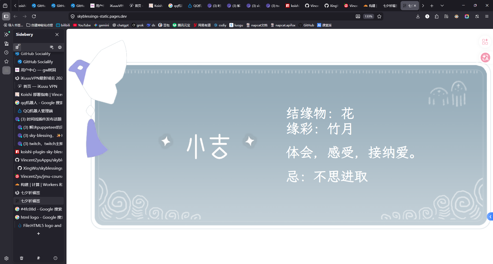

# 光遇七夕祈福签

> 纯前端， 光遇祈福签静态网页，支持在url后面种子和字体选择param(`?font=lxgw&a=xxx&b=yyy...`)。

[](https://github.com/VincentZyuApps/skyblessings-static-page)
[](https://gitee.com/vincent-zyu/skyblessings-static-page)

<p><del>💬 聊天吹水 / 🐛 Bug问题等反馈 / 👨‍💻 开发等技术交流，欢迎加入QQ群：<b>259248174</b>   🎉（这个群G了</del> </p>
<p>💬 聊天吹水 / 🐛 Bug问题等反馈 / 👨‍💻 开发等技术交流，欢迎加入QQ群：<b>1085190201</b> 🎉</p>
<p>💡 在群里直接艾特我，回复的更快哦~ ✨</p>

## 🌐 在线访问

> Github Page: `https://vincentzyuapps.github.io/skyblessings-static-page/`
> Cloudflare Page: `https://skyblessings-static.pages.dev/`

<a href="https://vincentzyuapps.github.io/skyblessings-static-page/">
  
</a>
<a href="https://skyblessings-static.pages.dev">
  
</a>

## 📸 页面预览



## ✨ 特性

- 🎲 **固定种子**：相同参数生成相同结果
- 🔤 **字体选择**：支持霞鹜文楷和隶书两种字体
- 🚀 **零依赖部署**：可部署到 GitHub Pages / Cloudflare Pages

## 🚀 本地尝试

### 克隆仓库

```bash
git clone https://github.com/VincentZyuApps/skyblessings-static-page.git
# 或者clone gitee的repo
git clone https://gitee.com/vincent-zyu/skyblessings-static-page.git
cd skyblessings-static-page
```

### 方法 1：使用 Python

```bash
# 建议使用 uv
# https://gitee.com/wangnov/uv-custom/releases
uv run python -m http.server 60408
```

### 方法 2：使用 npx（推荐）

```bash
npx serve -p 60408
```

#### 然后访问：`http://localhost:60408`

## 📖 使用说明

### URL 参数

| 参数 | 说明 | 可选值 | 示例 |
| :--- | :--- | :--- | :--- |
| `a`, `b`, `c`, `d`, `e` | 种子参数（任意组合） | 任意字符串 | `?a=玩家名&b=2026-04-08` |
| `font` | 字体选择 | `lxgw`（默认）/ `simli` | `?font=simli` |

### 字体

- **`lxgw`**（默认）：霞鹜文楷等宽体
- **`simli`**：隶书

### 种子参数说明

使用 `a`、`b`、`c`、`d`、`e` 任意组合作为种子，相同的参数组合会生成相同的结果：

```bash
# 使用单个参数
?a=玩家名

# 使用多个参数组合
?a=玩家名&b=2026-04-08

# 使用全部参数
?a=test&b=123&c=hello&d=world&e=sky
```

## 🌐 访问示例

```bash
# 页面展示（默认随机）
http://localhost:60408/

# 使用单个种子参数
http://localhost:60408/?a=test
http://localhost:60408/?a=玩家名

# 使用两个种子参数组合
http://localhost:60408/?a=test&b=123
http://localhost:60408/?a=玩家名&b=2026-04-08
http://localhost:60408/?a=Sky光遇&b=七夕祈福

# 使用多个种子参数组合
http://localhost:60408/?a=hello&b=world&c=sky
http://localhost:60408/?a=test&b=123&c=hello&d=world&e=sky

# 使用种子 + 字体（隶书）
http://localhost:60408/?a=玩家名&font=simli
http://localhost:60408/?a=玩家名&b=2026-04-08&font=simli
http://localhost:60408/?a=Sky光遇&b=七夕祈福&c=大吉&font=simli

# 使用种子 + 字体（霞鹜文楷，默认）
http://localhost:60408/?a=test&b=123&font=lxgw
http://localhost:60408/?a=玩家名&b=2026-04-08&font=lxgw

# 更多组合示例
http://localhost:60408/?a=晨曦&b=暮光&c=星辰
http://localhost:60408/?a=春&b=夏&c=秋&d=冬
http://localhost:60408/?a=东&b=南&c=西&d=北&e=中
http://localhost:60408/?a=金&b=木&c=水&d=火&e=土&font=simli
```

## 📦 部署

提交时在 commit message 中包含 `deploy` 关键词即可自动部署到 GitHub Pages 和 Cloudflare Pages。

```bash
git commit -m "feat: update (deploy)"
```

详见 [部署文档](.github/workflows/deploy.md)

## 下面是上游仓库的readme捏：
> 截止2026-0408
> 上游仓库github地址：[](https://github.com/XingWo/skyblessings) `(https://github.com/XingWo/skyblessings)` 

---

## python版细节更还原，逻辑更准确，go版相应更快，延迟更小，纯前端html+css+js最简洁

> 本仓库是祈福签 HTML+CSS+JQUERY 版本

> 光遇祈福签 API - Python 版本：https://github.com/XingWo/skyblessings-python-api

> 光遇祈福签 API - Go 版本：https://github.com/XingWo/skyblessings-go-api

 如需使用或调用请标注和支持，谢谢
 
 或联系我告知用途


## 哔哩哔哩by:星沃